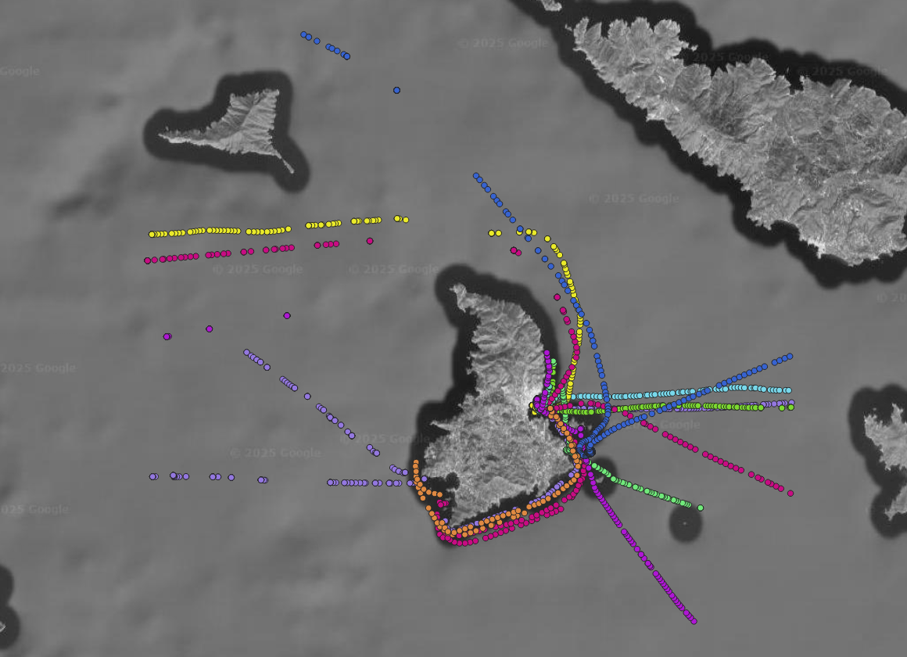
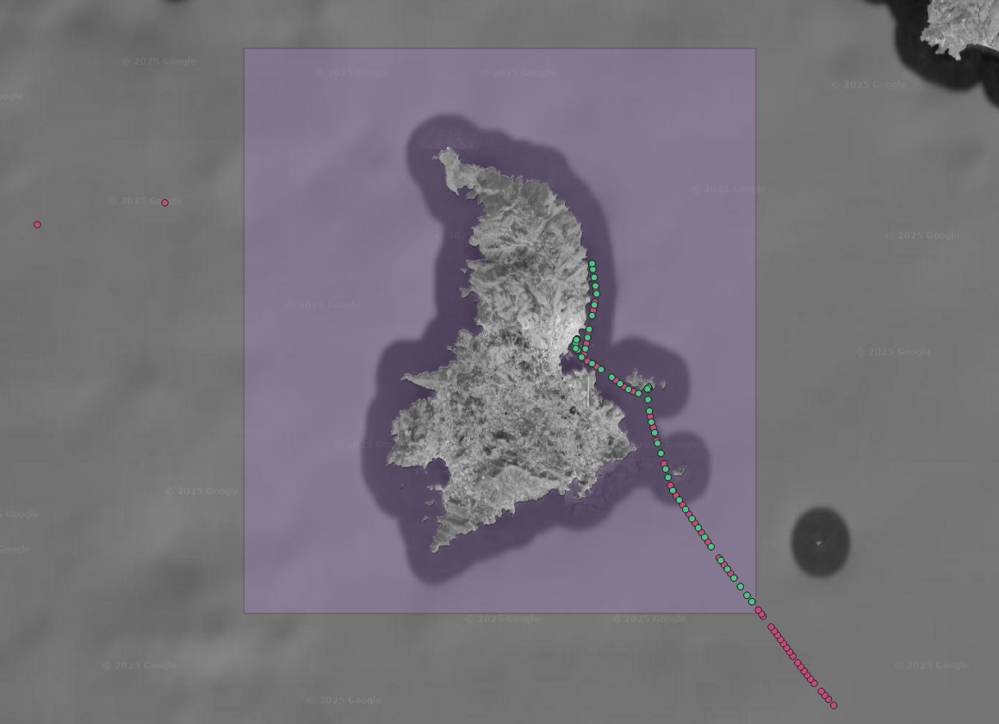
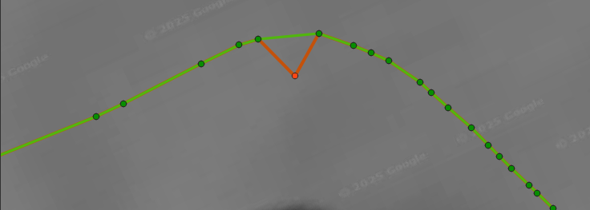
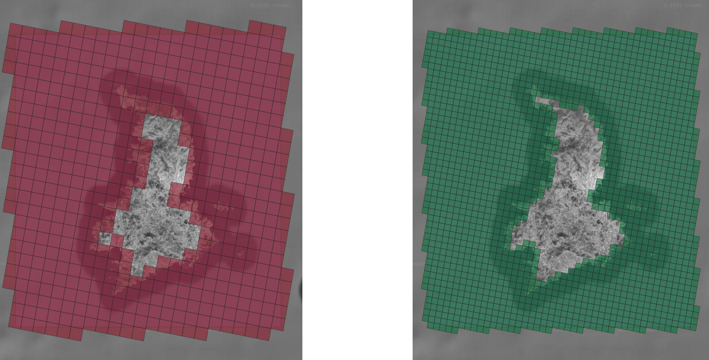
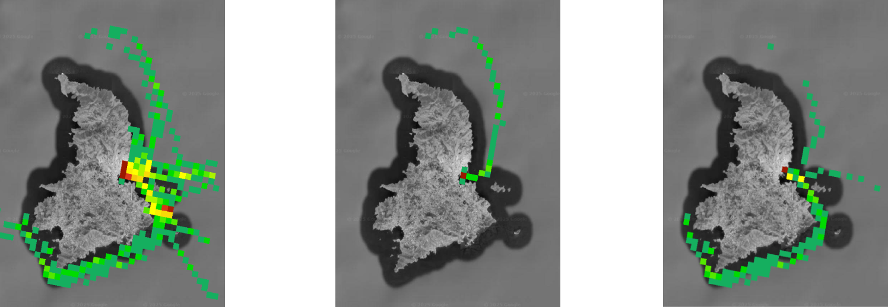
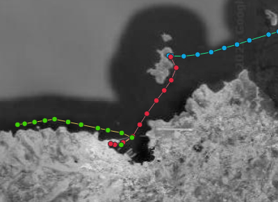

# AIS Manipulation Toolbox 

The provided repository is a Python toolbox, designed to manage, process and create effective vizualizations of vessel trajectories, as depicted in Automatic Identification Systems data. The toolbox comes with a series of functionalities to filter erroneous data, create precise selections and transform the trajectories. Additionally, processes like the extraction of specific (stop-to-stop) trips in the data and a tokenization methodology are provided. Finally, several density measures are included in the module, in order to create traffic visualizations best-fit for each use case. The toolbox is created in order to be easily extended and configuralbe according to the user-defined thresholds and methods.

This project takes advantage of the previously published open-source [toolbox by MarineTraffic](https://github.com/marinetraffic/mt-ais-toolbox), extending its capabilities and adding components towards the modelling of vessel traffic.

## Overview

 This document provides a brief overview of process, as well as the data and tools required, to generate density maps using "AIS toolbox". The data used in this overview are decoded historical Automatic Identification System (AIS) data.
 

## Installation - prerequisites

We strongly recommend running this module in virtual environment to ensure packages compatibility. 
	
	git clone https://github.com/ITSLab-UAegean/ais-manipulation.git;
	cd ais-manipulation/;
	python3 -m venv .venv;
	source .venv/bin/activate;
	pip install -e .;

Package installation in the virtual environment

	pip install -e .

To deactivate the virtual environment use:

	deactivate

The package can also be installed directly from our gitub repo with the following command, however additional 
changes in paths are required to run the following examples.

	pip install git+https://github.com/ITSLab-UAegean/ais-manipulation.git

Check also the [configuration section below](#Configuration)

### Installation on Windows OS

This toolbox relies on GDAL library, for rasterization processs mainly, thus installing it in windows operating system will require 
a working installation of GDAL across your system. 

To use this module in windows you are required to have a working GDAL installation before installing this toolbox. A workaround is installing GDAL through OSGeo4w (https://trac.osgeo.org/osgeo4w/) and define the appropriate paths to use the included python version instead. In addition, you  have to include the bin directory of osgeo installation folder to you PATH environmental variable.

## Technical Specifications
- Python version 3.8.6 or later. & installation of "requirements.txt" packages
- GDAL 3.0.4 ( In ubuntu systems you may execute *apt-get install gdal-bin libgdal-dev*)

	
## Quick Start

This package includes 
 - A configuration.json file that determines:
	- the AIS file path
	- the geometry file paths
	- the grid cells' size for cleaning and density-maps creation 
	- runtime parameters regarding the data cleaning, density calculation and trip extraction process

- Implementations for:
	- Loading AIS data
	- Cleaning the data
	- Generating grid
	- Generating density map using GDAL
	- Extracting trips for each vessel
	- Tokenization of vessel positions
	
	
 
 
Each step of our approach requires some parameters that include: paths for input files and output directories, flags regarding the operation to be executed, additional thresholds required during execution (e.g. downsampling rate). All that information should be included within a configuration file, that it should be passed as an argument during execution (e.g. config/config.json).

# The process
## Loading and splitting the AIS trajectory data

As a first step, the input AIS file should be split, according to the MMSI; meaning that each resulting file would have alll positions from a single vessel. The input thus for this step is a comma-separated values file. For this step, a small configuration file should be created, including only the original file path and the directory where the multiple files will be dumped on.

	python -m src.ais_manipulation.file_management.split_file config/config_split.json

### Input format
The input messages are AIS positional reports (also including the vessel type):

	TIMESTAMP,MMSI,LON,LAT,HEADING,COURSE,SPEED,TYPE

TIMESTAMP is expressed in as an EPOCH (in seconds), LON and LAT are the coordinates according to EPSG:4326, and TYPE is the vessel type number according to AIS.

*Sample dataset based on real vessel movement around the island of Syros, in Greece. The positions are collored according to the reported MMSI of the messages.*

## Data selection and cleaning
AIS data should be preprocessed before any significant analysis. Erroneous or incomplete messages should be removed, while spatial and temporal filters allow for more precise data selection. Finally a downsampling mechanism allows for temporal downsampling in order to redue the size of unnecessary large datasets.
The following command will clean the data in an effective way (in parallel), according to the filters selected in the configuration file, while also producing a statistics report of the process:
	
	python -m src.ais_manipulation.cleaning.data_cleaning config/config_cleaning.json 

*Clean dataset (green) for a single vessel of the input sample. The pink messages are filtered out, while the messages in light blue are kept. In purple you can see the area of interest (greater Syros area) as given to the module; the respective geometry can be found in the 'data/others' folder.*

Additionally, an optional step that takes advantage of Kalman filtering to remove noise positions is provided. For this filtering process, we assume a constant velocty model of movement for the vessel between the positions. Additionally, large temporal gaps between the messages (default value utilized 30 mins.) reinitialize the Kalman filter process. This process is not obligatory for the next steps (density maps, trip extraction, tokenization), and does not change the format of the data. Note that, this process does not project the coordinates itself, and should probably be applied after the cleaning step.

	python -m src.ais_manipulation.cleaning.kalman_filter config/config_kalman.json 

*An example of a trajectory where a position that did not follow the Kalman filtering (orange). Through this step we are able to remove it and continue with a track with less noisy data (green).*

## Creating different density maps
Using the cleaned AIS tracks, we are able to generate effective visual representations of the vessel traffic. In order to do so, a density metric should be selected and applied on each grid cell separately. Here we provide a few options (time spent by the vessels, number of vessel passing, number of AIS messages available etc.). The code is structured tso it would be easy for the user to add their own metric for their analysis. To extract the density maps simply use the following command.
	
	python -m src.ais_manipulation.density.export_density_maps config/config_density.json 

*Two grids of selected side lengths (1000 and 500 meters); smaller grid sizes result in more precise results but takes more time in execution.*

*Density maps for the area of interest, for all, tanker and pleasure vessels respectively. The number of positions were used for this calculation.*

## Merging AIS files
Since most applications require a single file for processing, we include a dedicated script that merges the contents of an AIS folder into a single final file. 

	python -m src.ais_manipulation.file_management.merge_files config/config_merge.json

## Extracting vessel trips
In order to analyze and better process AIS tracks it is quite useful to know the different trips followed by the vessels. Here we provide a solution for annotating the AIS messages with the appropriate trip identifier. In order to do so, we consider the vessel "stops" based on the reported SPEED, and do not focus solely on port to port voyages. Some thresholds regarding the maximum time gap between the messages, the minimum messages for considering a separate trip and other are defined within the code, and could be altered according to the needs of the user.

	python -m src.ais_manipulation.trips.find_trips config/config_trips.json

So, for example, the result for a single vessel would be the following (with different colors signaling messages from different trips of the same vessel):

---
### Cleaning Filters (detailed)
The filters provided by the AIS toolbox include:
- Removing all messages with empty coordinates, timestamp, speed or course fields.
- Removing points outside the area of interest (as defined from the configuration file), including points on land. 
	- We expect a multi-polygon object representing the sea area of interest, in any of the following supported geometry file types: geopackage, geodatabase, geojson.
- The AIS data are down-sampled according to the configuration ratio provided (in milliseconds). The downsampling is performed so that two consecutive messages from the same vessel could not have a time interval shorter than the threshold. Naturally, as a result of this process duplicate signals are removed.
- Messages with wrong MMSI numbers are removed (according to the list provided in the configuration file).
- Signals with invalid speed and course over ground(SOG/COG) values are removed.
- Noise messages were removed. This is achieved by eliminating messages that indicate improbable transitions, i.e. where vessels would have needed to move with a speed over 92.0 knots.
- Vessels with total messages fewer than a given threshold are not processed and all their AIS messages are discarded.

The configuration file given determines which of the above filters would be applied.

# Configuration

The toolbox configuration files are json files that consist of the parameters that control among others the input and output paths, adjust the sensitivity of the data cleaning process and control other aspects of the map generation process. Some indicative parameters are listed below. Additionally, some sample config files are included in the /config folder.

| *Parameter* |	*Description*                                   | *Default Values* |
|:----------|:---------------------------------------------------|:--------------|
|"geometry_file_path" | Path for geometry file used| in config|
|"grids_path"| Path for saving grid | in config |
|"ais_path"|Path of merged AIS messages directory| in config |
|"ais_cleaned_path"|Path of cleaned AIS messages directory|  in config |
|"density_path"| Path of resulting density files directory |  in config |
|"colors_files_path"| Path of density file (TIFF) color files directory   |  in config |
|"ais_stats_path"|Path for the statistics directory|  in config |
|"out_crs"| Output coordinate reference system code (CRS 3035 or 3857(not tested) ) | 3035 |
|"empty_fields"|If true removes messages with empty fields | false |
|"invalid_movement_fields"|If true removes messages with invalid values in COG,SOG,LON,LAT fields| false |
|"invalid_mmsi"|If true removes messages with invalid mmsi values (see below)| false |
|"false_mmsi"|List of MMSIs to be excluded| in config |
|"land_mask"|If true it enforces land-masking process| false |
| "bounding_box"|  List of coordinates that indicate the area of interest. The coordinates are in the format: [minLon, minLat, maxLon, maxLat], and must follow the output projection system | optional in config (example: [5905000, 2185000, 5910000, 2190000])|
|"downsample"|If true it enforces downsampling process| false|
|"downsample_rate"| Downsampling rate (in milli-seconds)| in config (example: 180000 ~ 3 mins) |
|"noise_filter"|If true it enforces noise filtering process by eliminating messages that indicate improbable transitions|in config |
|"grid_edge_lengths"|List of grid cell lengths for the grid generation. Each length indicates the size of edge on each dimension (in meters).| in config (example: [500000,200000,10000])|
|"timeframe"| If true it enforces a filter regarding each messages timestamp. If true, the "start_time"/"end_time" must be defined (using the EPOCH representation - in milliseconds) | false|
|"start/end_time"| The startin/ending times for the teimframe filter (in milliseconds) | in config (example: 1647592893000)|
|"min_positions"|Number of minimum AIS messages for the file to be included in the cleaning process| 10|
|"max_threads"| Maximium number of threads during execution; only for the processes that work in parallel| 4 |
|"density_method"| Method to be used for density maps 'vessels_count'(default) or 'time_at_cells' |'vessels_count' | 'positions_count' |
|"density_vessel_types"|List of types of vessels to be considered while creating density maps. One map will be generated for each vessel type, based on the type codes provided in the AIS. The 'All' option includes all vessels regardless their type. Options include: ['All', 'Cargo', 'Tanker', 'Dredging', 'HSC', 'Fishing', 'Military_Law', 'Passenger', 'Pleasure', 'Sailing', 'Service', 'Tug', 'Unknown', 'Other']|'All'|

Directory ('colors_files_path')  with color files should include a TXT file, named 'colors_{GEL}.txt' with GEL is the each grid edge length in meters (example: 'colors_1000.txt'). Each file should include the density thresholds followed by the appropriate color, expressed as RGB and with an opacity indicator (0-255).

# Licenses - Requirements
You may extract requirements from imports using the command : *pipreqs --force*

You may use the *pip-licenses* package to check dependencies licences  

	pip-licenses -p pyproj geopandas Fiona haversine pandas Shapely

results in :

	Fiona      1.8.21   BSD License 
	Shapely    2.0.0    BSD License 
	geopandas  0.10.2   BSD         
	haversine  2.5.1    MIT License 
	pandas     1.4.2    BSD License 
	pyproj     3.3.1    MIT License 

## Acknowledgement :
 ***This work has been partially supported by the "Athena" Research Center, as part of the project MIS 5154714 of the National Recovery and Resilience Plan Greece 2.0 funded by the European Union under the NextGenerationEU Program.***

## License Terms 
 This work is licensed under a <a rel="license" href="http://creativecommons.org/licenses/by-nc-sa/4.0/">Creative Commons Attribution-NonCommercial-ShareAlike 4.0 International License</a>.
